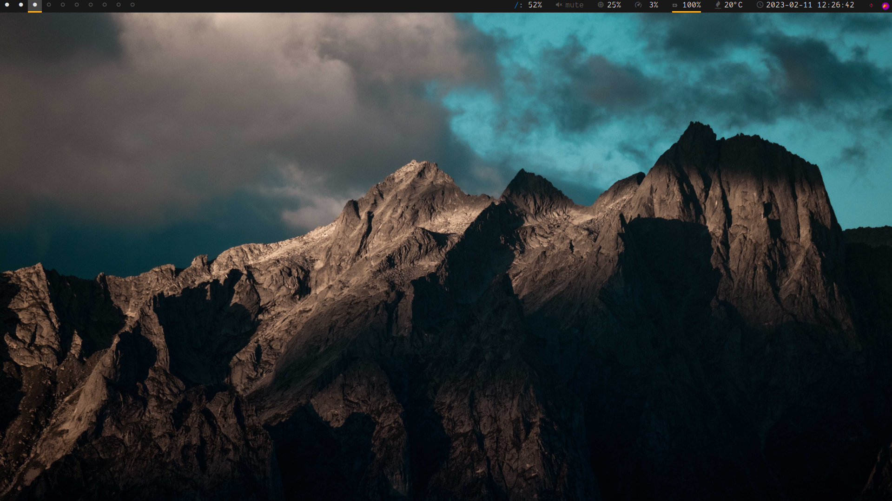
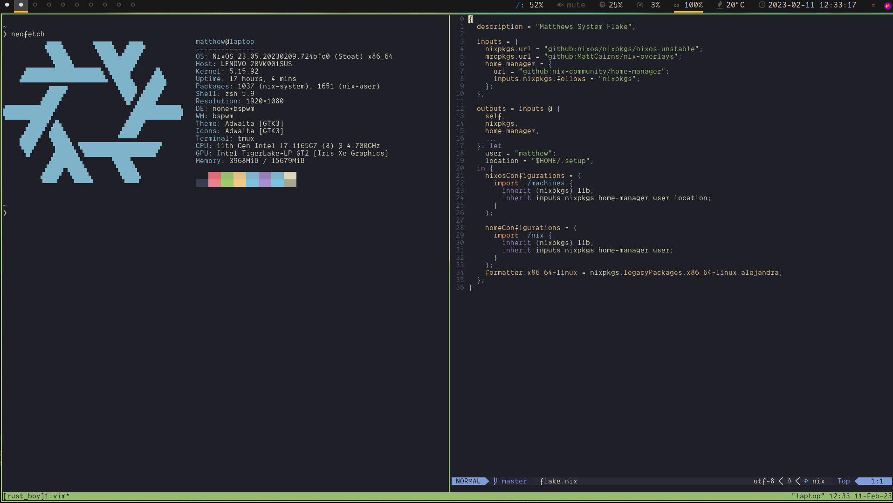

# Matts Rice
This repo is constantly evolving to suite my purposes and contains everything I need to quickly configure and use my work, personal and laptop computers.

<p align="center">
  
   
</p>

## Some of whats included
- Fully configured Neovim with lots of fun plugins.
  - Treesitter
  - lsp
  - completion
  - debugging for C++/Rust
  - Much more
- Firefox profiles for Work and Home 
  - Removal of annoying firefox things like the password saving
  - Clear data on quit
  - Disable telemetry, pocket, studies, etc
- tmux
  - Builtin scripts to run tmux on terminal open 
  - Quickly switch between projects in tmux using [tmux-sessionizer](https://github.com/jrmoulton/tmux-sessionizer)


## Dependencies
- NixOS.  

If you have NixOS then installation is a simple as:

```bash
cd ~
git clone git@github.com:MattCairns/nixos-config.git
cp /etc/nixos/hardware-configuration.nix ~/nixos-config/machines/<MACHINE>/.
cd ~/nixos-config/
sudo nixos-rebuild switch --flake .#<MACHINE>
sudo reboot now
```

If you dont have NixOS feel free to pull stuff out of here for your own purposes.

## Talon Voice
- The configuration vendors in [`talon-nix`](https://github.com/nix-community/talon-nix) and enables `programs.talon`, which places the Talon FHS wrapper on the system path and installs the matching udev rules.
- After rebuilding (`sudo nixos-rebuild switch --flake .#<MACHINE>`), launch Talon with `talon`. On first run you'll be prompted for the license email/key from [talonvoice.com](https://talonvoice.com).
- Home Manager drops the [`talonhub/community`](https://github.com/talonhub/community) bundle into `~/.talon/user/community` and provisions a sample `demo hello` voice command so every machine starts with usable scripts.
- Optional: run `snixembed` if you want the tray icon in environments without legacy systray support, and sync your voice command repositories into `~/.talon/user` as usual.
