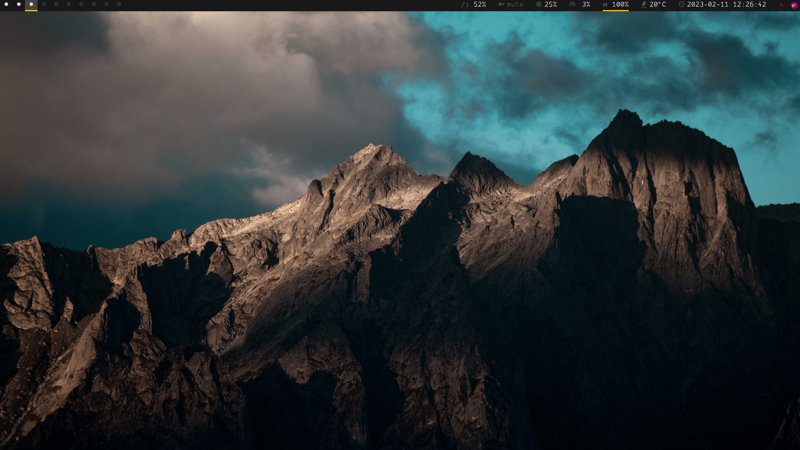
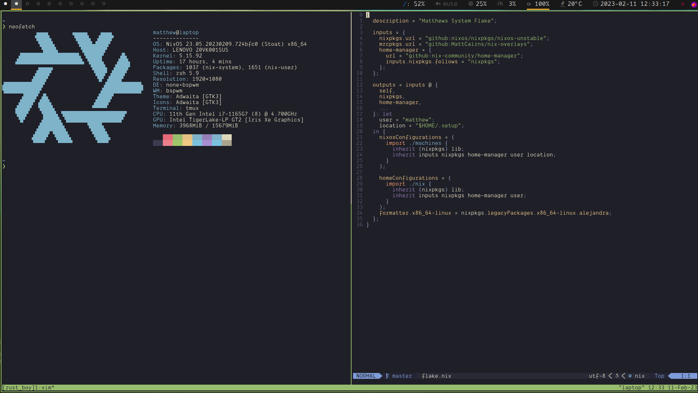

# Matts Rice
This repo is constantly evolving to suite my purposes and contains everything I need to quickly configure and use my work, personal and laptop computers.

<p align="center">
  
   
</p>

## Some of whats included
- Fully configured Neovim with lots of fun plugins.
  - Treesitter
  - lsp
  - completion
  - debugging for C++/Rust
  - Much more
- Firefox profiles for Work and Home 
  - Removal of annoying firefox things like the password saving
  - Clear data on quit
  - Disable telemetry, pocket, studies, etc
- tmux
  - Builtin scripts to run tmux on terminal open 
  - Quickly switch between projects in tmux using [tmux-sessionizer](https://github.com/jrmoulton/tmux-sessionizer)


## Dependencies
- NixOS.  

Hosts are `framework` and `desktop`. A fresh `desktop` is installed from a NixOS installer with disko:

```bash
git clone git@github.com:MattCairns/nixos-config.git
cd nixos-config
sudo nix run .#install-desktop
```

On an existing install:

```bash
cd ~/nixos-config
nh os switch   # or: sudo nixos-rebuild switch --flake .#<host>
```

If you dont have NixOS feel free to pull stuff out of here for your own purposes.
